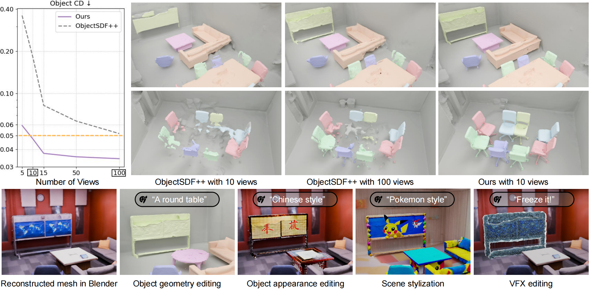

<h2 align="center">
  <b>Decompositional Neural Scene Reconstruction</b>
  <br>
  <b>with Generative Diffusion Prior</b>

  <b><i>CVPR 2025 </i></b>
</h2>

<p align="center">
    <a href="https://dali-jack.github.io/Junfeng-Ni/">Junfeng Ni</a><sup>1,2</sup>,
    <a href="https://yuliu-ly.github.io/">Yu Liu</a><sup>1,2</sup>,
    <a href="https://jason-aplp.github.io/Ruijie-Lu/">Ruijie Lu</a><sup>2,3</sup>,
    <a href="https://github.com/zr-zhou0o0">Zirui Zhou</a><sup>1</sup>,
    <a href="https://zhusongchun.net/">Song-Chun Zhu</a><sup>1,2,3</sup>,
    <a href="https://yixchen.github.io/">Yixin Chen<sup>✉</sup></a><sup>2</sup>,
    <a href="https://siyuanhuang.com/">Siyuan Huang<sup>✉</sup></a><sup>2</sup>
    <br>
    <a style="font-size: 0.9em; padding: 0.5em 0;"><sup>✉</sup> indicates corresponding author</a> &nbsp&nbsp 
    <sup>1</sup>Tsinghua University 
    <br>
    <sup>2</sup>State Key Laboratory of General Artificial Intelligence, BIGAI &nbsp&nbsp 
    <sup>3</sup>Peking University
</p>

<p align="center">
    <a href='https://arxiv.org/abs/2503.14830'>
      
    </a>
    <a href='https://youtu.be/QnJCoWiauro'>
      
    </a>
    <a href='https://dp-recon.github.io/'>
      
    </a>
</p>

<p align="center">
    
</p>

DP-Recon incorporates diffusion priors for decompositional neural scene reconstruction to enhance reconstruction quality in sparsely captured and heavily occluded regions.

## Installation

- Tested System: Ubuntu 20.04, CUDA 11.8
- Tested GPUs: A100, A800

```bash
conda create -n dprecon python=3.9
conda activate dprecon
pip install torch==2.0.1 torchvision==0.15.2 --index-url https://download.pytorch.org/whl/cu118
pip install tensorflow-hub
pip install -r requirements.txt
pip install accelerate
pip install lightning==2.2.3
pip install xformers==0.0.20             # need exactly match torch version
pip install setuptools==69.5.1
pip install git+https://github.com/KAIR-BAIR/nerfacc.git@v0.5.2
pip install git+https://github.com/NVlabs/tiny-cuda-nn/#subdirectory=bindings/torch
pip install git+https://github.com/ashawkey/envlight.git
pip install git+https://github.com/openai/CLIP.git
pip install git+https://github.com/NVlabs/nvdiffrast.git
# pip uninstall datasets                  # if have conflict with local datasets
```
If you are unable to access huggingface to download SD 1.5, SD 2.1, CLIPs or inpainting models, you can download them from [here](https://drive.google.com/file/d/1KR6WBdzfo9s2U3BVIQ84z6vNw1qm39L2/view?usp=drive_link) and place the `$pretrained_models` files to `code/pretrained_models`. Then, configure huggingface to load models from local files as follows:
```bash
export TRANSFORMERS_OFFLINE=1
export DIFFUSERS_OFFLINE=1
export HF_HUB_OFFLINE=1
export HF_HOME=./code/pretrained_models/huggingface
```

## Data
Please download the preprocessed [data](https://drive.google.com/drive/folders/1VUo6egav6j4aBw_ADRFP4NEE8pgB4alq?usp=drive_link) and unzip in the `data` folder. The resulting folder structure should be:
```bash
└── DP-Recon
  └── data
    ├── replica
        ├── scan ...
    ├── scannetpp
        ├── scan ...
    ├── youtube
        ├── scan ...
    ├── scene_style_prompt.json       # scene style prompt we have tried
```
YouTube data are obtained from YouTube videos ([link to scan1](https://www.youtube.com/watch?v=UNKC6coX7zg), [link to scan2](https://www.youtube.com/watch?v=7KnC6qGVgng) and [link to scan3](https://www.youtube.com/watch?v=FuUdxiUIT1c)), with camera poses calibrated using COLMAP and object masks extracted by SAM2. This showcases the robust generalizability of our method to in-the-wild indoor scenes.

Since the full dataset is quite large, we use the `replica/scan1` as an example scene. Please download this scene [here](https://drive.google.com/file/d/1AMdVIBpqeOj5SZ9mp16S93Ato8XyNoDx/view?usp=drive_link) and ensure it is placed under `data/replica` following the folder structure.


## Training
```bash
cd code
# 1.decompositional reconstruction + add geometry prior
torchrun training/exp_runner.py --conf CONFIG  --scan_id SCAN_ID --prior_yaml geometry.yaml
### CONFIG is the config file in code/confs, and SCAN_ID is the id of the scene to reconstruct.
### By default, training logs are saved using wandb. If you prefer to use TensorBoard, you can set the '--none_wandb'.

# 2.(Optional but recommended) Manually select the best background inpainting result to reduce the randomness of the inpainting process.

# 3.add texture prior
torchrun training/exp_runner.py --conf CONFIG  --scan_id SCAN_ID --prior_yaml texture.yaml --is_continue --ft_folder PATH_TO_EXP --checkpoint CKPT_EPOCH

### Example training command (use the Replica scan1):
torchrun training/exp_runner.py --conf confs/replica_grid.conf  --scan_id 1 --prior_yaml geometry.yaml
# (Optional) Manually select the best background inpainting result from '../exps/dprecon_grid_replica_110/2025_03_16_23_12_57/plots/sds_views/obj_0/bg_pano/inpaint/' to replace randomly selected result '../exps/dprecon_grid_replica_110/2025_03_16_23_12_57/plots/sds_views/obj_0/bg_pano/bg_inpaint.png'
torchrun training/exp_runner.py --conf confs/replica_grid.conf  --scan_id 1 --prior_yaml texture.yaml --is_continue --ft_folder ../exps/dprecon_grid_replica_110/2025_03_16_23_12_57 --checkpoint 7500
```
Some of our reconstructed results are available [here](https://drive.google.com/drive/folders/15YQcd1VyQWDjXrmw1RTqH3iBAI7bjWhk?usp=drive_link).

## Evaluation
### 1. Reconstruction
```bash
# evaluate total scene
python eval/eval_scene_recon.py --dataset_type DATASET     # DATASET could be 'replica' or 'scannetpp'
# evaluate each object
python eval/eval_object_recon.py --dataset_type DATASET
# evaluate bg
python eval/eval_bg_recon.py --dataset_type DATASET
```

### 2. Rendering
```bash
# evaluate Full-Reference metrics (i.e., PSNR, SSIM, LPIPS)
python eval/eval_rendering.py --dataset_type DATASET
# evaluate No-Reference metrics (i.e., MUSIQ)
python eval/eval_musiq.py --dataset_type DATASET
# evaluate object mask
python eval/eval_mask.py --dataset_type DATASET
```

## Acknowledgements
Some codes are borrowed from [MonoSDF](https://github.com/autonomousvision/monosdf), [RICO](https://github.com/kyleleey/RICO), [ObjectSDF++](https://github.com/QianyiWu/objectsdf_plus), [ThreeStudio](https://github.com/threestudio-project/threestudio), [Fantasia3D](https://github.com/Gorilla-Lab-SCUT/Fantasia3D) and [RichDreamer](https://github.com/modelscope/richdreamer). We thank all the authors for their great work. 

## Citation

```bibtex
@inproceedings{ni2025dprecon,
  title={Decompositional Neural Scene Reconstruction with Generative Diffusion Prior},
  author={Ni, Junfeng and Liu, Yu and Lu, Ruijie and Zhou, Zirui and Zhu, Song-Chun and Chen, Yixin and Huang, Siyuan},
  booktitle=CVPR,
  year={2025}
}
```

